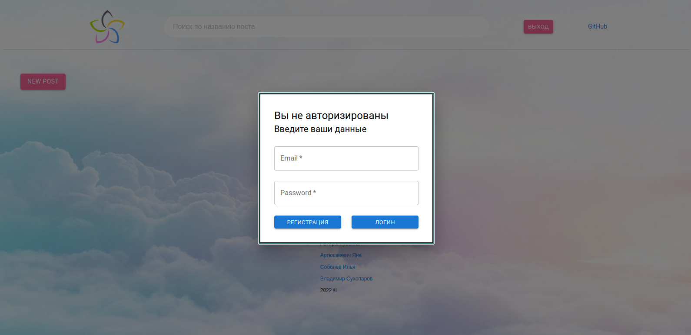
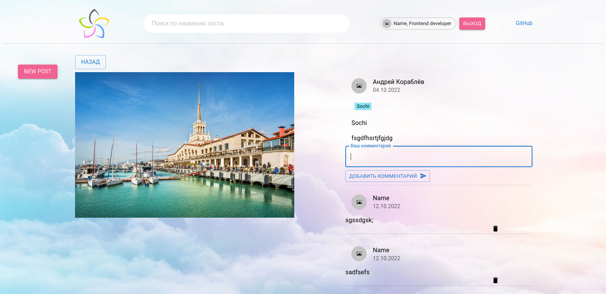

# SPA with posts

Registration/authorization is required when logging in to the site


After logging in, you can edit user information


Window for creating a new post


Route to the post itself, where you can write/delete comments


Implemented a search by the name of the post


Implemented pagination


***
### Install dependencies

```bash
yarn install
```

### Run

```bash
yarn start
```
