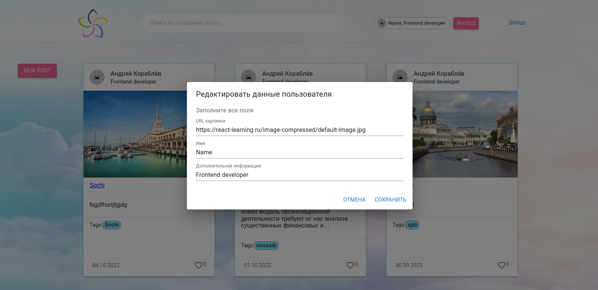

# Небольшой сайт с постами

При входе на сайт требуется регистрация/авторизация


После входа можно редактировать информацию о пользователе


Окно создания нового поста


Route на сам пост, где можно писать/удалять комментарии


Реализован поиск по названию поста


Реализована пагинация

***
### Install dependencies

```bash
yarn install
```

### Run

```bash
yarn start
```
